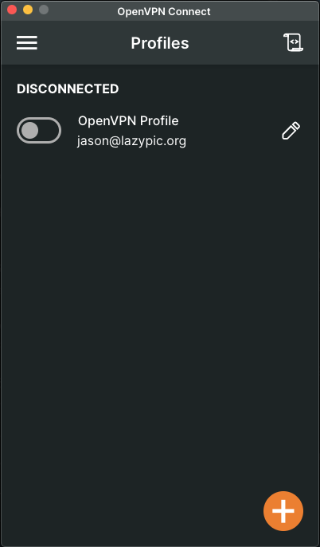

# OpenVPN
Lazypic,LLC OpenVPN 설정 방법을 다루는 문서입니다. 컴퓨터, 모바일에서 Laypic,LLC의 Privit 네트워크를 접속할 수 있습니다.

## 개요

Privit 네트워크를 사용하기 위해서는 OpenVPN을 설치해야 네트워크에 접속할 수 있습니다.
[OpenVPN 클라이언트](https://openvpn.net/client/)를 다운로드 받습니다. admin@lazypic.org 로 부터 발급받은 `.opvn` 파일을 Client에 추가해줍니다.
터미널을 열고 ping `10.0.0.2` 라고 타이핑해서 ping이 작동되는지 체크해보세요. 모바일에 OpenVPN 이미 클라이언트를 깔있다면, 이메일을 통해 첨부된 `.opvn` 파일을 클릭하면 OpenVPN 클라이언트로 열지 물어보게 됩니다.

OpenVPN 클라언트에서 스위치를 켜고 끄는 것 만으로 Public, Privit 네트워크를 전환할 수 있습니다.
원하시는 서버 또는 가상머신이 있다면 해당 서버를 admin@lazypic.org에 요청해주세요.
